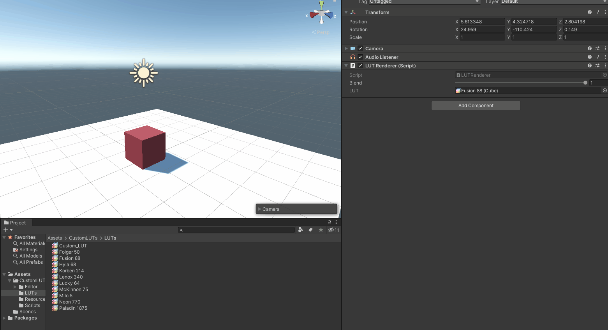

## My custom .cube file importer and LUT renderer!

### Features:
- Imports and serializes .cube files
- Uses a full screen compute shader to apply the LUT
- Allows for blending

### References:
- [Harry Alisavakis - My take on shaders: Color grading with Look-up Textures (LUT)](https://halisavakis.com/my-take-on-shaders-color-grading-with-look-up-textures-lut/)
